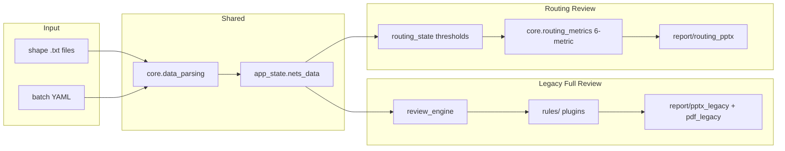

# CLAUDE.md

This file provides guidance to Claude Code (claude.ai/code) when working with code in this repository.

## Project Overview

Professional Layout Review Tool for SRAM/analog circuit layouts. Two analysis
pipelines run side-by-side:

1. **Full-pipeline review** (legacy, exercised in the right-panel "Run Full
   Review" path and `report_generator.py`): shape import → `review_engine`
   RC/EM/matching → rule plugins → PPTX/PDF.
2. **Routing review** (newer, the default Routing Config / Routing Review
   tabs): shape import → 6-metric aggregator in `core.routing_metrics` →
   threshold gating → `report/routing_pptx.py`.

Both pipelines share input parsing (`core.data_parsing`, `app.state`) and
visualization (`core.visualization`), but have **separate state objects and
separate callbacks**.

## Commands

```bash
# Install
pip install -r requirements.txt

# Run the Dash UI at http://localhost:8050
./start.sh                       # defaults to port 8050
./start.sh 8080                  # alternate port
python layout_review_app.py 8080

# Tests (canonical entry point)
python -m pytest tests/ -q
python -m pytest tests/ --cov=core --cov=rules --cov-fail-under=60
python -m pytest tests/test_routing_metrics.py::test_compute_for_net_returns_all_six_metrics
pytest tests/test_rules_integration.py

# Lint
python -m ruff check .

# Deprecated — emits DeprecationWarning
python tests/run_tests.py
```

`pyproject.toml` configures pytest (`pythonpath = ["."]`), ruff, and coverage.
`tests/conftest.py` provides shared fixtures. CI: `.github/workflows/test.yml`.

## High-Level Architecture

### Module map

| Path | Role |
|------|------|
| `layout_review_app.py` | Dash entry point. Builds the app, registers two callback groups (legacy + routing), serves the 4-tab UI. |
| `review_engine.py` | Legacy full-pipeline engine. Defines `Point`, `Polygon`, `Via`, `WireSegment`, `NetRCData`, `Violation`, `ReviewSummary`, `ProfessionalLayoutReviewEngine`. Also RC calculation, EM analysis, BL/BLB matching. |
| `config_system.py` | Legacy config dataclasses: `CheckRule`, `TechConfig`, `LayoutReviewConfig`, and preset factories `get_sram_7nm_config()`, `get_sram_5nm_config()`, `get_analog_config()`. |
| `report_generator.py` | Legacy report shim → `report/pptx_legacy.py`, `report/pdf_legacy.py`. |
| `report/routing_pptx.py` | Routing Review tab PPTX output. |
| `core/geometry.py` | Polygon/segment distance helpers (used by `review_engine`). |
| `core/layer_style.py` | Centralized layer fill colors for viz + reports. |
| `pdk/sram_7nm.yaml` | 7nm PDK layers + design rules; loaded via `config/pdk_loader.py`. |
| `core/` | Shared analysis modules (no dependencies on Dash). |
| `rules/` | Plugin rule system — **wired** into `review_engine._execute_check_rule` via `create_rule()`. |
| `core/routing_metrics.py` | The 6-metric aggregator actually used by the Routing Review tab. Calls `core.directional_analyzer`, `core.via_coverage`, `core.rc_calculator.compute_net_metrics_with_tau`, and `core.golden_similarity`. |
| `core/rc_calculator.py`, `directional_analyzer.py`, `via_coverage.py`, `golden_similarity.py`, `effective_tau.py`, `matching_analyzer.py`, `data_parsing.py`, `visualization.py`, `path_analysis.py`, `report_visualization.py` | Individual analyzers. |
| `config/routing_thresholds.py` | `RoutingThresholds` dataclass + 4 built-in presets (`sram_7nm_wl`, `sram_5nm_io_bl`, `analog_default`, `power_relaxed`). `validate()` enforces `max_h_ratio + max_v_ratio ≥ 1.0`. |
| `config/preset_loader.py` | YAML load/save for `RoutingThresholds`. Reads from `config/presets/*.yaml`. |
| `config/presets/*.yaml` | Three user-editable preset files (sram_5nm_io_bl, sram_7nm_wl, analog_default). |
| `app/state.py` | `AppState` singleton — nets_data, engine, config, zoom/view state. Used by the legacy callbacks and by `app/routing_state` (which reads `app_state.nets_data` for regex resolution). |
| `app/routing_state.py` | `RoutingState` singleton — preset, thresholds, golden_net_name, batch_results, review_completed. |
| `app/routing_config.py` | Routing Config tab UI + `register_routing_config_callbacks`. |
| `app/routing_review.py` | Routing Review tab UI + `_run_routing_review()` + `register_routing_review_callbacks`. The 6-metric cards, sortable table, and PPTX download button live here. |
| `app/layout.py`, `app/callbacks.py`, `app/theme.py` | Legacy tab layout and callbacks (Layout View, Report Export, right-panel Properties). |

| `rules/base_rule.py` | `BaseRule`, `ConstraintType`, `Severity`, `RuleParameter`. `matches_net()` uses regex against `TARGET_NETS`. |
| `rules/registry.py` | `RuleRegistry` singleton + `@register_rule(category)` decorator. |
| `rules/{drc,si,em,sram,qty}/__init__.py` | **All rules for a category live in one file each** (see "Rule plugin quirk" below). |
| `tests/` | Mixed unittest + pytest. Fixture shape files are `shapes_test_*.txt` next to the test code. |
| `assets/` | Local Bootstrap + Font Awesome CSS + `eda-theme.css` (Dash avoids CDN at runtime). |

### Architecture (dual pipeline)



### Data flow — routing review (the default path)

1. User uploads `.txt` shape files or a YAML batch config on the Layout View tab. `app/callbacks.py:update_net_selector` populates `app_state.nets_data` and creates a `ProfessionalLayoutReviewEngine`, calling `calculate_net_rc` for every net.
- **Net identity:** `app_state.nets_data` keys are composite `source/net_name` (e.g. `report_32x128/trk_dbl_sa`). `source` is the file's parent directory or YAML `source:` override; browser single-file uploads use `_default`.
2. On Routing Config tab, user picks a YAML preset + threshold values + golden/batch regex. `register_routing_config_callbacks` mutates the global `routing_state` singleton.
3. On Routing Review tab, clicking **Run Routing Review** calls `_run_routing_review()` (`app/routing_review.py:255`). It resolves the regexes against `app_state.nets_data`, then for each net calls `core.routing_metrics.compute_for_net(...)` which returns a 6-metric dict.
4. The callback rebuilds the 6 metric cards (averages), the sortable per-net table, and the directional viz (`create_directional_figure`).
5. **Generate Routing Report (PPTX)** → `report/routing_pptx.generate_routing_pptx(state, app_state, out_path)`, downloaded via `dcc.send_file`.

### Data flow — full review (legacy)

`app_state.engine.run_full_review()` → for each net: RC + rule plugins + matching. Violations feed `app/callbacks.py` right-panel summary and `report_generator.py`.

### Rule plugin quirk

All rules for a category are **stacked in `rules/{category}/__init__.py`** — there is no per-rule file. `RuleRegistry` discovers them via the `_auto_import_rules()` call in `rules/__init__.py` (which imports each subpackage), and `@register_rule("drc")` decorates the classes. Adding a new rule means editing the category's `__init__.py`, not creating a new file. Each rule reads from `net_data` via `getattr(net_data, "wire_segments", [])` / `getattr(net_data, "total_resistance", 0)` etc. — pair-wise checks (BL/BLB) are no-ops in the rule body and are handled at the engine level.

### Two state singletons

- `app.state.app_state` — global app state (nets_data, config, engine, zoom/view). Read by both pipelines.
- `app.routing_state.routing_state` — routing review state (preset, thresholds, golden/batch results). Mutated by routing callbacks, read by `report/routing_pptx.py`.

`app.callbacks` writes `app_state`; `app.routing_config` and `app.routing_review` write `routing_state`. Both are module-level instances — there is no DI. Tests instantiate `RoutingState()` directly when needed (see `tests/test_routing_pptx.py`).

### Adding a new routing metric or threshold field

1. Add the field to `RoutingThresholds` in `config/routing_thresholds.py` and to `_BUILTIN_PRESETS`.
2. Extend `check_gates` in `core/routing_metrics.py`.
3. Add a `THRESHOLD_FIELDS` entry in `app/routing_config.py` and the corresponding `dcc.Input(id=f"thresh-{name}")` will be wired up automatically.
4. Add a metric card entry to `METRIC_CARD_IDS` in `app/routing_review.py` (and the averaging block in `_build_metric_cards`).
5. Update each `config/presets/*.yaml`.

### Adding a new rule

Edit the relevant `rules/{drc,si,em,sram,qty}/__init__.py`, add a class with `RULE_ID`/`NAME`/`SEVERITY`/`TARGET_NETS` (regex) and `PARAMETERS`, decorate with `@register_rule("category")`, implement `check(self, net_name, net_data, polygons) -> list[dict]`. Rules are loaded at import time, so a process restart is needed.

## Notes / gotchas

- **2026-06-21 governance:** `rules/` plugin path active in full review; `routing_check.py` and `rc_prediction.py` removed; `suppress_callback_exceptions=False`; upload writes `nets-meta-store`; Phase 4 module split (`geometry`, `layer_style`, `report/*_legacy`, `pdk/sram_7nm.yaml`); Phase 5: ruff + pytest coverage gate (60%) + GitHub Actions CI.
- RC Prediction tab removed (2026-06-20). `routing_state.get_rc_model()` uses built-in `RCModelConfig` defaults.
- `split_metal_via_polygons()` / `coerce_vias()` in `core/routing_metrics.py` — used by routing review and legacy upload via `_rebuild_engine_from_nets()`.
- Full Review: `btn-run-review-panel` sets `app_state.review_completed`; Report Export requires it.
- `review_engine.calculate_net_rc` is invoked on upload even for nets the user never reviews; this is intentional so right-panel properties are populated immediately.
- `config_system.py` lives at the repo root (not under `config/`). The `config/` package holds routing-threshold YAML (`preset_loader.py`) and PDK YAML (`pdk_loader.py`). Don't move `config_system.py`.
- `TechConfig.get_default_7nm()` loads from `pdk/sram_7nm.yaml`; inline fallback is `TechConfig._get_default_7nm_inline()`.

## Task 8: Manual verification (2026-06-26)
This task performs final manual (simulated via python + pytest exercising state, data load, callbacks helpers) verification of the dual-pipeline routing review flow:

Steps followed:
1. App start: `python layout_review_app.py` (module import + create_app exercised).
2. Layout View load: sample shapes (e.g. shapes_test_*.txt) imported via core.data_parsing + _store_net_entry + _rebuild_engine_from_nets into app_state.nets_data + engine.
3. Routing Config: preset switches, Locked/Editable (is_frozen) toggles via set_frozen_mode / set_custom, edits, Apply modeled, tab re-activation via "tabs" input re-renders from routing_state.get_thresholds() + get_threshold_source().
4. Run review: _run_routing_review path + compute_for_net using routing_state.get_thresholds(); gates reflect applied values.
5. Commit per spec.

Verified key behaviors (via direct python state manipulation + dedicated tests):
- RC values match between Properties (engine.net_rc_data after calculate_net_rc) and Review (compute_for_net) — see test_rc_values_match_between_properties_and_routing_review, test_rc_consistency.
- Presets load (RoutingThresholds.for_preset) without triggering red/invalid (wide min/max + no early validate).
- Locked/Editable toggle: disabled= is_frozen for inputs, button classes via _mode_button_classes, _disabled_list.
- Apply commits via set_custom (is_frozen=False) and values persist on tab switches (re-reads on "tabs.value").
- Review reflects thresholds: source banner, "value / thresh" in _build_metric_cards and table, check_gates uses latest.
- All UI labels and static text are English (get_threshold_source() now returns pure English "Locked preset: ..." / "Custom (based on ...)"; no Chinese or old "Frozen" terminology in UI strings).
- Style consistent (layout tests + theme classes pass).
- All tests pass: python -m pytest tests/ -q (100%).

Note: minor pre-existing lint (unused no_update) and Dash/Plotly deprecation warnings ignored as out of scope.

Updated during Task 8 for docs.

